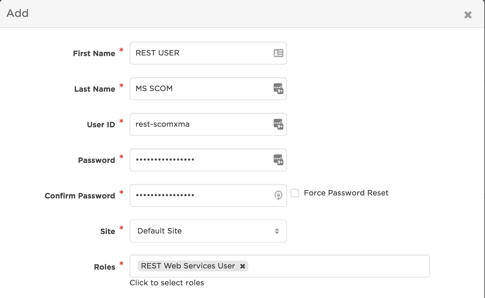

# Microsoft System Center Operations Manager (MS SCOM) 2012

> **Note**: You can find our newest SCOM integration, supporting SCOM 2016 and using the latest and greatest in Integration Builder technology, [here](https://www.xmatters.com/integration/microsoft-scom/)


This integration with Microsoft SCOM allows you to locate and notify on-call resolvers when critical network incidents are detected. With the SCOM, the right technician can take direct action on incident tickets in real time from any mobile device.

Network operational and failure information is presented to the message recipient via multiple communication channels, allowing technicians to action updates remotely. As actions are taken, xMatters updates the tickets with informational annotations to provide a full audit trail.

<kbd>
  
</kbd>

# Pre-Requisites
* Version 2012 of Microsoft SCOM
* Account in Microsoft SCOM
* xMatters Integration Agent 5.1.8.2 (or later)
* xMatters account - If you don't have one, [get one](https://www.xmatters.com)!

# Files
* [MSSCOM201231.zip](MSSCOM201231.zip) - This is the Communication Plan for the Microsoft SCOM 2012 v3.1 integration. It is also included in the integration package zip.
* [xM-MS-SCOM-2012_3_1.zip](xM-MS-SCOM-2012_3_1.zip) - This is the integration package for the Microsoft SCOM 2012 v3.1 integration. It includes the xMatters Communication Plan and the xMatters Integration Agent files, referenced later in these instructions.

# How it works
When a new SCOM 2012 alert triggers a given subscription, a SCOM notification channel delivers notification subscriber alerts. As a subscriber, the xMatters Integration Agent receives a command line injection, including these properties: alert ID, event source, event local time, management group name, priority, severity, server name, and resolution state. The xMatters Integration Agent enriches the event by also getting the event description. The xMatters Integration Agent then creates an xMatters event and notifies the specified recipient Group. The SCOM alert status is updated to Sent To xMatters.

The notified resolver responds with Acknowledge - to take ownership of the notification and update the SCOM alert status to Acknowledged, Work In Progress - to update the SCOM alert status to Work In Progress, Close - to update the SCOM alert status to Closed, or Ignore - to escalate to the next resource in the xMatters on call schedule.

The closed loop integration also annotates the Alert History with xMatters event status, notification delivery status, and user responses.

# Installation
To begin, download the integration zip file attached to this article and extract it to a location on your local machine. Some of the instructions in this article reference specific folders within the extracted integration archive.  

## xMatters set up
### Create a REST user account

<kbd>
  
</kbd>  

### Import the Communication Plan
* Import the MS SCOM 2012 Communication Plan [MSSCOM201231.zip](MSSCOM201231.zip)
* Instructions to import a Communication Plan can be found here: [Import a Communication Plan](http://help.xmatters.com/OnDemand/xmodwelcome/communicationplanbuilder/exportcommplan.htm)

### Assign permissions to the Communication Plan and Form  
* On the Communication Plans page, click the Edit drop-down menu for the MS SCOM 2012 3.1 communication plan then select Access Permissions
* Add the REST User created above
* On the Communication Plans page, click the Edit drop-down menu for the MS SCOM 2012 3.1 communication plan then select Forms
* Click the Web Service drop-down menu for the SCOM Event form
* Select Sender Permissions then add the REST User created above

### Configure the xMatters Integration Agent
Now that you've configured xMatters On-Demand, it's time to configure the integration agent.

The installation instructions below assume you already have a working xMatters integration agent.  If this is a new installation and you have not yet deployed the integration agent please follow this link to download, deploy and configure:   [Integration Agent for xMatters 5.x & xMatters On-Demand](https://support.xmatters.com/hc/en-us/articles/201463419)

#### To install the package and configure the integration agent:
* Within the extracted integration archive, navigate to \components\integration-agent
* Copy the contents of the folder to the installation directory of the integration agent, for example:   `C:\integrationagent-5.1.8.2`
* This folder is referred to as <IAHOME> in the remainder of the instructions.
* Open `<IAHOME>\conf\IAConfig.xml` and add the following line to the `<service-configs>` section: `<path>msscom/msscom.xml</path>`
* Save and close the file
* Open deduplicator-filter.msscom.xml in the integration package folder components\integration-agent\conf and copy everything from `<filter name="msscom">` to and including `</filter>`
* Close the file
* Open the `<IAHOME>\conf\deduplicator-filter.xml` and paste the <filter> section copied above to the <deduplicator> section
* Save and close the file
* Open the `<IAHOME>\integrationservices\msscom\configuration.js` file and set the values for the following variables:
  * WEB_SERVICE_URL - the IB Inbound Integration URL using Basic Authentication
  * INITIATOR - REST User ID created above
  * userName - User ID of the SCOM user that is accessing the Alert, changing the status and updating Alerts
  * simpleLogin - When set to true, will use only the serverName to create a connection to the Microsoft Enterprise Management Group
  * serverName - Server name for the server running SCOM
  * domain - Domain from which SCOM Alerts will be queried
  * debugLogging - When set to true, debug logging information will be logged into `<IA_HOME>\integrationservices\msscom\log\`

## Microsoft SCOM set up
Now that you've configured xMatters to integrate with your system, it's time to configure Microsoft SCOM 2012 to integrate with xMatters. This requires that you configure the following components in Microsoft SCOM 2012:

  * Notification channels
  * Notification subscribers
  * Notification subscriptions
  * Add/update resolution status
  
### Configure Notification Channels
The notification channels define how SCOM 2012 delivers the information to xMatters, which attributes of the event should be sent, and when to remove the event from xMatters.

#### To set a New alerts notification channel:
  * In SCOM 2012, in the Administration pane, expand Notifications, and then click Channels.
  * Right-click in the Channels pane, and then select New Channel.
  * In the Command Notification Channel dialog box, in the Channel Name field, type Send New Alert via xMatters, and then click Next.
  * In the Full path of the command file field, type the path to the APClient.bin.exe file in the xMatters integration agent installation folder; the default location is `<IAHOME>\bin\APClient.bin.exe`.
  * In the Command line parameters field, type the following:
  ```--map-data "applications|msscom" "add" "false" "$Data/Recipients/To/Address/Address$" "$Data/Context/DataItem/AlertId$" "$Data/Context/DataItem/AlertName$" "$Data/Context/DataItem/TimeRaisedLocal$" "$Target/ManagementGroup/Name$" "$Data/Context/DataItem/Priority$" "$Data/Context/DataItem/Severity$" "$Data/Context/DataItem/ManagedEntityDisplayName$" "$Data/Context/DataItem/ResolutionState$"```
  
  Note: If you want to copy and paste the above command from this article into the Command line parameters field, paste the text into a plain text file first, and remove any line breaks and other formatting. You can then copy the command from the text file and paste it into the Microsoft SCOM 2012 field.
  * In the Startup folder for the command line field, type the <IAHOME> directory.
  * Click Finish, and then click Close.

#### To set a Closed alerts notification channel:
  * In SCOM 2012, in the Administration pane, expand Notifications, and then click Channels.
  * Right-click in the Channels pane, and then select New Channel.
  * In the Command Notification Channel dialog box, in the Channel Name field, type Terminate Closed Alerts in xMatters, and then click Next.
  * In the Full path of the command file field, type the path to the APClient.bin.exe file in the xMatters integration agent installation folder; the default location is `<IAHOME>\bin\APClient.bin.exe`.
  * In the Command line parameters field, type the following:
  ```--map-data "applications|msscom" "del" "false" "$Data/Recipients/To/Address/Address$" "$Data/Context/DataItem/AlertId$" "$Data/Context/DataItem/AlertName$" "$Data/Context/DataItem/TimeRaisedLocal$" "$Target/ManagementGroup/Name$" "$Data/Context/DataItem/Priority$" "$Data/Context/DataItem/Severity$" "$Data/Context/DataItem/ManagedEntityDisplayName$" "$Data/Context/DataItem/ResolutionState$"```
  
  Note: If you want to copy and paste the above command from this article into the Command line parameters field, paste the text into a plain text file first, and remove any line breaks and other formatting. You can then copy the command from the text file and paste it into the Microsoft SCOM 2012 field.
  * In the Startup folder for the command line field, type the <IAHOME> directory.
  * Click Finish, and then click Close.

#### To set an FYI alerts notification channel:
  * In SCOM 2012, in the Administration pane, expand Notifications, and then click Channels.
  * Right-click in the Channels pane, and then select New Channel.
  * In the Command Notification Channel dialog box, in the Channel Name field, type Send FYI Alert via xMatters, and then click Next.
  * In the Full path of the command file field, type the path to the APClient.bin.exe file in the xMatters integration agent installation folder; the default location is `<IAHOME>\bin\APClient.bin.exe`.
  * In the Command line parameters field, type the following:
  ```--map-data "applications|msscom" "add" "true" "$Data/Recipients/To/Address/Address$" "$Data/Context/DataItem/AlertId$" "$Data/Context/DataItem/AlertName$" "$Data/Context/DataItem/TimeRaisedLocal$" "$Target/ManagementGroup/Name$" "$Data/Context/DataItem/Priority$" "$Data/Context/DataItem/Severity$" "$Data/Context/DataItem/ManagedEntityDisplayName$" "$Data/Context/DataItem/ResolutionState$"```
  
  Note: If you want to copy and paste the above command from this article into the Command line parameters field, paste the text into a plain text file first, and remove any line breaks and other formatting. You can then copy the command from the text file and paste it into the Microsoft SCOM 2012 field.
  * In the Startup folder for the command line field, type the <IAHOME> directory.
  * Click Finish, and then click Close.

### Configure Notification Subscriptions
Once you have created the command channel and configured the subscribers, you can set up a subscription to allow xMatters to subscribe to Microsoft SCOM 2012 alerts. You can create subscriptions against different kinds of alerts; the following instructions describe how to subscribe against two criteria as a way of demonstrating the process, and how to configure a subscription that will delete the corresponding event in xMatters when an alert is closed.

#### Create a New Alerts Subscription
  * In the Administration pane, under Notifications, click Subscriptions.
  * Right-click in the Subscriptions pane, and then select New Subscription.
  * On the Create Notification Subscription page, in the Subscription name field, type xMattersSubscription, and then click Next.
  * On the Criteria page, use the Conditions and Criteria description boxes to create a subscription that will notify on all new alerts of a Warning or Critical severity.
  * Click Next.
  * On the Subscribers page, add the “xMatters” subscriber you defined in the previous section, and then click Next.
  * On the Channels page, add the Send New Alert via xMatters command channel created above, and then select the Send notifications without delay option.
  * Click Next.
  * Click Finish, and then click Close.

#### Create a Closed Alerts Subscription
  * In the Administration pane, under Notifications, click Subscriptions.
  * Right-click in the Subscriptions pane, and then select New Subscription.
  * On the Create Notification Subscription page, in the Subscription name field, type xMattersSubscription, and then click Next.
  * On the Criteria page, use the Conditions and Criteria description boxes to create a subscription that will notify on all new alerts of a Warning or Critical severity.
  * Click Next.
  * On the Subscribers page, add the “xMatters” subscriber you defined in the previous section, and then click Next.
  * On the Channels page, add the Terminate Closed Alerts in xMatters command channel created above, and then select the Send notifications without delay option.
  * Click Next.
  * Click Finish, and then click Close.

### Configure Alert Resolution Settings
You must add three new resolution states to account for alerts that are sent to xMatters: Acknowledged, Owned, and SentToxMatters. Note that the resolution state names and IDs described in the details below match those configured in the default integration files; if you want to use different names or IDs, you must also edit the configuration file (as described above).

#### To add new Alert Resolution Settings:
  * In the Administration pane, click Settings, and then double-click Alerts.
  * In the Global Management Group Settings dialog box, on the Alert Resolution States tab, click New.
  * In the Resolution state name field, type Acknowledge.
  * In the ID field, type 101.
  * Click Save.
  * In the Global Management Group Settings dialog box, on the Alert Resolution States tab, click New.
  * In the Resolution state name field, type Work In Progress.
  * In the ID field, type 102.
  * Click Save.
  * In the Global Management Group Settings dialog box, on the Alert Resolution States tab, click New.
  * In the Resolution state name field, type Sent To xMatters.
  * In the ID field, type 103.
  * Click Save.

# Testing
The following sections indicate how the integration works by targeting the example group (xMattersSCOMGroup) with a notification and reviewing how the alert is updated in Microfost SCOM 2012 with the user's response.

## Trigger a notification
The example described in this section uses a forced IP address conflict to illustrate how an alert is sent through xMatters to a user’s device, and how xMatters and Microsoft SCOM 2012 process the user’s response.

<kbd></kbd> <kbd></kbd>

### To test the integration:
  * Using the Windows Local Area Connection Properties dialog, force an IP conflict between two computers that Microsoft SCOM 2012 is monitoring; for example, assign the Microsoft SCOM 2012 server’s IP address to another machine on the network.
  * An alert is created in Microsoft SCOM 2012
  * The alert is sent to the xMatters Integration Agent, targeting xMattersSCOMGroup.
  * The Alert Properties dialog box displays the details of the alert.
  * The alert status is updated to "Sent to xMatters".

### Respond to the notification
  * Open the xMatters notification in the xMatters Application or in email.
  * Scroll down to review the details and view the replies.
  * Click a response choice
  * xMatters updates the alert status in Microsoft SCOM 2012.

### View the Microsoft SCOM alert status updates
After responding to the notification, for example with Acknowledge, you can view the results of the response in Microsoft SCOM 2012; the Active Alerts pane updates the Resolution State to Acknowledged and the History tab displays the sequence of notifications and responses.

# Troubleshooting
If an xMatters notification was not received you can work backwards to determine where the issue may be:  
* Review the xMatters Reports tab and the specific [Event Log](http://help.xmatters.com/OnDemand/installadmin/reporting/eventlogreport.htm)  
* If no Event was created, review the [xMatters Inbound Integration Activity Stream](http://help.xmatters.com/OnDemand/xmodwelcome/integrationbuilder/activity-stream.htm)  
* If no activity was recorded, review the xMatters Integration log an injection to the xMatters Integration Agent
* If no injectiona activity in the xMatters Integration Agent, review the Microsoft SCOM 2012 logs for the results of the subscription trigger to the xMatters Integration Agent

## Enable SCOM Logging
It is possible to enable logging for the component that interacts with SCOM within the Integration. 

  * Open the `<IAHOME>\integrationservices\msscom\configuration.js` file in a text editor and set the debugLogging parameter to "true".

When set to true, debug logging information will be logged into: `<IA_HOME>\integrationservices\applications\msscom\log\`
